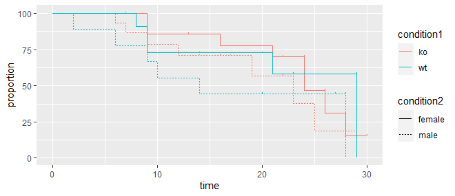
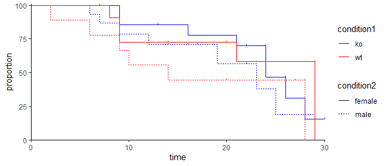
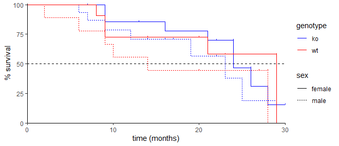
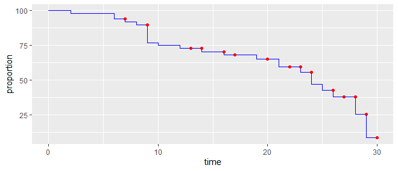

# ggsurvival

This package lets you easily plot survival information in [ggplot2](https://ggplot2.tidyverse.org/).

## Installation
Install the ggbrace package from the git repository:
``` r
devtools::install_github("solatar/ggsurvival")
```

## Create a survival curve
Load the package, create your survival plot:
``` r
library(ggsurvival)
library(ggplot2)

#to showcase ggsurvival, let's create a test data.frame
survtest <- data.frame(
  time = sample(seq(30),50,replace = T),
  status = sample(1:2, 50, replace = T),
  condition1 = sample(c("wt","ko"), 50, replace = T),
  condition2 = sample(c("female", "male"), 50, replace = T)
)

ggplot() +
  geom_surv(aes(time, status, color=condition1, linetype=condition2), data=survtest)
```



That's already it! Your data.frame needs to have at least 2 columns: one for the survival time and one for the survival status. In aes(x,y), time has to be assigned to x and status has to be assigned to y. You can name these columns however you want. For the status column take care that the following is true:
- 2: death
- 1: censored (drop out of study)
- NA: will be ignored
- everything else: alive

The survival curve follows a couple of rules:
1) The total sample number is normalized to 100 for each condition.
2) In the beginning a death event will lead to a drop of 1 unit (a unit is: 100 / number of samples).
3) With each censored event, following death events lead to a larger drop.
4) A censored event does not lead to a drop. Therefore, if the last event is censored, the curve will not drop to 0.
5) An alive status behaves the same as a censored event, except it is not indicated in the graph.

You probably also have a column by which you distinguish samples, e.g. mutation, sex, etc. In ggsurvival you can have up to 2 of such columns. The parameters in geom_surv's aes() you can use for this are <b>color</b> and <b>linetype</b>.

## Modify the graph

First of all you can change the ticks if you like. Use the ticks parameter in the geom_surv function.

``` r
ggplot() + 
  geom_surv(aes(time, status, color=condition1, linetype=condition2), data=survtest, ticks = "point")
```


This also allows you to change the shape of the points:

``` r
ggplot() + 
  geom_surv(aes(time, status, color=condition1, linetype=condition2), data=survtest, ticks = "point", shape=2)
```


You can modify the residual appearance of the graph as you usually would. However, geom_surv comes with an inbuilt option to set certain parameters to make the graph more pretty. Unlock this simply by specifying surv_pretty as TRUE.

``` r
ggplot() +
  geom_surv(aes(time, status, color=condition1, linetype=condition2), data=survtest, surv_pretty=T)

#this will create the exact same plot
ggplot() +
  geom_surv(aes(time, status, color=condition1, linetype=condition2), data=survtest) +
  scale_color_manual(values=c("blue","red")) +
  scale_x_continuous(expand=c(0,0)) +
  scale_y_continuous(expand=c(0,0)) +
  theme_classic()
```



Use your usual ggplot modifications to change the graph as you whish.

``` r
ggplot() +
  geom_hline(yintercept=50, linetype="dashed") +
  geom_surv(aes(time, status, color=condition1, linetype=condition2), data=survtest, surv_pretty=T) +
  labs(x="time (months)", y="% survival", color="genotype", linetype="sex")
```



## Plot lines and ticks seperately

ggsurvival also offers the functions geom_survLines and geom_survTicks to modify these components.

``` r
ggplot() +
  geom_survLines(aes(time, status), data=survtest, color="blue") +
  geom_survTicks(aes(time, status), data=survtest, color="red", ticks="point")
```


